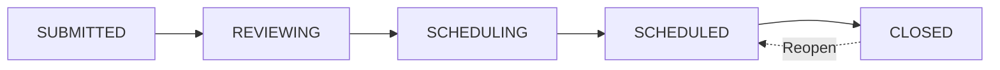

# 🚀 Claim Completion Architecture

## Overview
This feature upgrade prepares Cascade Connect for the migration of 11.5k claims by adding comprehensive completion tracking. The system now differentiates between "Scheduling" and "Completion" logic, allowing admins to mark claims as completed when work is finished.

---

## 🎯 Key Features

### 1. Enhanced Status Tracking
- **New Status Values**: `OPEN` and `CLOSED` added to the claim status enum
- **Status Flow**: OPEN → SUBMITTED → REVIEWING → SCHEDULING → SCHEDULED → CLOSED
- **Backward Compatible**: Existing COMPLETED status remains for legacy claims

### 2. New Database Fields

#### `scheduledAt` (timestamp, nullable)
- Records when an appointment was confirmed/scheduled
- Distinct from `proposedDates` JSON array
- Automatically set when admin confirms appointment
- Used for reporting and analytics

#### `completedAt` (timestamp, nullable)
- Records when the work was actually finished
- Distinct from `dateEvaluated` (which tracks when claim was reviewed)
- Set when admin clicks "Mark as Completed"
- Can be cleared if claim needs to be reopened

### 3. UI Enhancements

#### Warranty Modal - Appointment Section
- **Visual Indicator**: Shows "Work Completed" instead of "Appointment Confirmed" when closed
- **Completion Date Display**: Shows when work was completed
- **Mark as Completed Button**: 
  - Visible for admins only
  - Only appears when appointment is scheduled
  - Updates status to CLOSED and sets completedAt timestamp
- **Reopen Button**: Allows reopening closed claims if needed

#### Warranty Cards
- **Blue "Closed" Badge**: Replaces "Reviewed" badge when claim is closed
- **Visual Hierarchy**: Closed badge takes priority over reviewed badge
- **Status at a Glance**: Users can quickly identify completed work

---

## 📋 Database Migration

### Running the Migration

1. **Using Drizzle CLI** (Recommended):
```bash
npm run db:migrate
```

2. **Manual SQL Execution**:
```bash
psql -U your_username -d your_database -f drizzle/migrations/add-claim-completion-fields.sql
```

### Migration Details

The migration script (`add-claim-completion-fields.sql`) performs:
1. ✅ Adds `OPEN` and `CLOSED` values to `claim_status` enum
2. ✅ Adds `scheduled_at` and `completed_at` columns to claims table
3. ✅ Creates indexes for performance optimization
4. ✅ Adds column comments for documentation
5. ✅ Includes optional data migration for existing claims

### Rollback (if needed)
```sql
-- Remove new columns
ALTER TABLE claims DROP COLUMN IF EXISTS scheduled_at;
ALTER TABLE claims DROP COLUMN IF EXISTS completed_at;

-- Note: PostgreSQL doesn't support removing enum values easily
-- If you need to remove OPEN/CLOSED statuses, you'll need to recreate the enum
```

---

## 🎨 UI Components Updated

### 1. `ClaimInlineEditor.tsx`
**Location**: Appointment Confirmed Card section

**Changes**:
- Dynamic header text based on status
- Completion date display
- "Mark as Completed" button with handler
- "Reopen Claim" button for closed claims
- Auto-updates `scheduledAt` when marking complete

**Code Example**:
```typescript
onClick={() => {
  onUpdateClaim({
    ...claim,
    status: ClaimStatus.CLOSED,
    completedAt: new Date(),
    scheduledAt: scheduledDate ? new Date(scheduledDate.date) : undefined
  });
}}
```

### 2. `WarrantyCard.tsx`
**New Props**:
- `isClosed?: boolean` - Whether claim is completed

**Visual Changes**:
- Blue "Closed" badge with CheckCircle icon
- Badge hierarchy: Closed > Reviewed > Classification

### 3. `Dashboard.tsx`
**Changes**:
- Passes `isClosed={claim.status === ClaimStatus.CLOSED}` to WarrantyCard
- Renders closed badge on claim cards

### 4. `App.tsx`
**Backend Integration**:
- `handleUpdateClaim` now persists `scheduledAt` and `completedAt` fields
- Database updates include new timestamp columns

---

## 🔄 Workflow Examples

### Standard Claim Lifecycle



### Marking a Claim as Completed

1. **Admin views claim with scheduled appointment**
2. **Clicks "Mark as Completed" button**
3. **System updates**:
   - `status` → `CLOSED`
   - `completedAt` → Current timestamp
   - `scheduledAt` → Appointment date (if not already set)
4. **Visual feedback**:
   - Card shows blue "Closed" badge
   - Header changes to "Work Completed"
   - Completion date appears

### Reopening a Closed Claim

1. **Admin views closed claim**
2. **Clicks "Reopen Claim" button**
3. **System updates**:
   - `status` → `SCHEDULED`
   - `completedAt` → `null`
4. **Claim returns to active scheduling state**

---

## 📊 Reporting & Analytics

### New Query Capabilities

**Find all completed claims**:
```sql
SELECT * FROM claims 
WHERE status = 'CLOSED' 
AND completed_at IS NOT NULL
ORDER BY completed_at DESC;
```

**Claims completed this month**:
```sql
SELECT COUNT(*) FROM claims 
WHERE status = 'CLOSED' 
AND completed_at >= DATE_TRUNC('month', CURRENT_DATE);
```

**Average time from scheduled to completed**:
```sql
SELECT AVG(completed_at - scheduled_at) as avg_completion_time
FROM claims 
WHERE scheduled_at IS NOT NULL 
AND completed_at IS NOT NULL;
```

**Claims by contractor performance**:
```sql
SELECT 
  contractor_name,
  COUNT(*) as total_completed,
  AVG(completed_at - scheduled_at) as avg_time_to_complete
FROM claims 
WHERE status = 'CLOSED'
GROUP BY contractor_name
ORDER BY total_completed DESC;
```

---

## 🔐 Permissions

### Admin Only
- Mark claims as completed
- Reopen closed claims
- View completion timestamps
- Access completion analytics

### Homeowners & Contractors
- View completion status (read-only)
- See blue "Closed" badge on completed claims
- Cannot mark claims as completed

---

## ⚠️ Important Notes

### For the 11.5k Claims Migration

1. **Status Mapping**:
   - Existing `COMPLETED` claims can be migrated to `CLOSED`
   - Or keep `COMPLETED` as a legacy status
   - Recommended: Map `COMPLETED` → `CLOSED` for consistency

2. **Timestamp Backfilling**:
   ```sql
   -- Optional: Backfill scheduledAt for migrated claims
   UPDATE claims 
   SET scheduled_at = COALESCE(date_evaluated, date_submitted)
   WHERE status IN ('SCHEDULED', 'COMPLETED') 
   AND scheduled_at IS NULL;
   ```

3. **Performance Considerations**:
   - Indexes added for `scheduled_at` and `completed_at`
   - Queries should remain performant even with 11.5k+ claims

### Data Integrity

- `completedAt` should only be set if `status` = `CLOSED`
- `scheduledAt` should only be set if appointment is confirmed
- Both fields are nullable to handle edge cases

### Testing Checklist

- [ ] Mark claim as completed
- [ ] Verify completedAt timestamp is set
- [ ] Verify status changes to CLOSED
- [ ] Check blue "Closed" badge appears
- [ ] Reopen claim and verify completedAt is cleared
- [ ] Test with claim that has no scheduled appointment
- [ ] Verify read-only access for non-admins

---

## 🐛 Troubleshooting

### Issue: Migration fails with enum error
**Solution**: Run this to check existing enum values:
```sql
SELECT enumlabel FROM pg_enum 
WHERE enumtypid = (SELECT oid FROM pg_type WHERE typname = 'claim_status');
```

### Issue: "Mark as Completed" button not showing
**Causes**:
1. User is not admin
2. Claim has no scheduled appointment
3. Claim is already closed

### Issue: completedAt not persisting
**Check**: Verify `App.tsx` includes new fields in database update:
```typescript
completedAt: updatedClaim.completedAt || null,
scheduledAt: updatedClaim.scheduledAt || null,
```

---

## 📚 Related Documentation

- [AI Warranty Assistant](AI-WARRANTY-ASSISTANT.md)
- [Schedule Tab Implementation](SCHEDULE-TAB-IMPLEMENTATION.md)
- [Database Schema Guide](DATABASE-SCHEMA-FIX.md)
- [Drizzle Migration Setup](MIGRATION-SETUP.md)

---

## 🎉 Summary

✅ **Schema**: Added `scheduledAt` and `completedAt` columns  
✅ **Status**: Added `OPEN` and `CLOSED` enum values  
✅ **UI**: "Mark as Completed" button with visual feedback  
✅ **Backend**: Full persistence of completion data  
✅ **Performance**: Indexed for efficient queries  
✅ **Migration**: Ready for 11.5k claims import  

**Status**: ✅ READY FOR PRODUCTION

