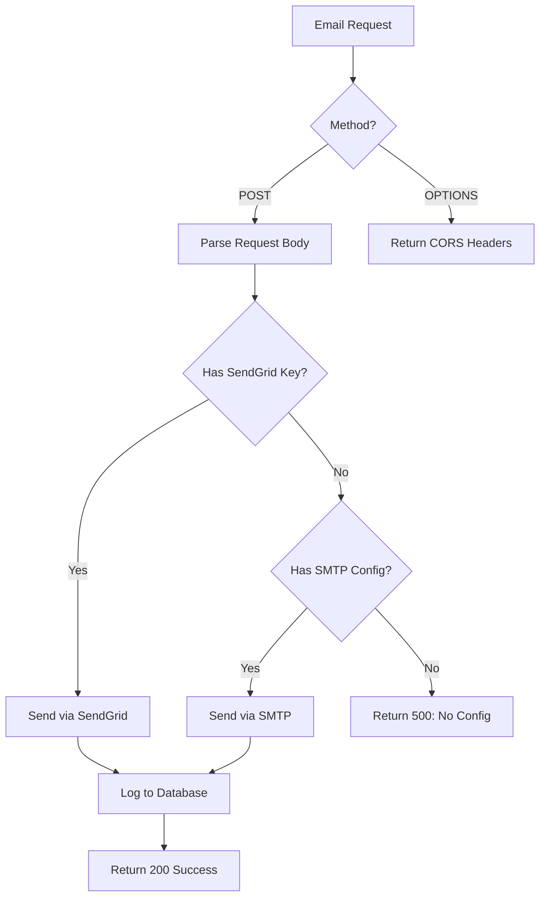

# 🚨 Email 502 Error - Quick Fix Guide

## Problem
You're getting a **502 Bad Gateway** error when sending email notifications after creating a claim. This happens because the email Netlify function (`email-send.ts`) doesn't have the required email service credentials configured.

## Root Cause
The function checks for email configuration in this order:
1. **SendGrid** (if `SENDGRID_API_KEY` exists)
2. **SMTP** (if `SMTP_HOST`, `SMTP_USER`, `SMTP_PASS` exist)
3. **Returns 500 error** if neither is configured

The 502 error likely means the function is crashing or timing out because it can't validate the email configuration.

---

## ✅ Solution: Configure Email Service

### Option 1: SendGrid (Recommended)

**Why SendGrid?**
- Free tier: 100 emails/day
- Better deliverability
- Webhook support for replies
- Used by your other services

**Steps:**

1. **Get SendGrid API Key:**
   - Go to https://app.sendgrid.com/settings/api_keys
   - Click "Create API Key"
   - Name: "Cascade Connect Notifications"
   - Permissions: "Full Access" (or at least "Mail Send")
   - Copy the API key (you'll only see it once!)

2. **Get/Verify Sender Email:**
   - Go to https://app.sendgrid.com/settings/sender_auth/senders
   - Add a verified sender email (e.g., `notifications@yourdomain.com`)
   - Or use a domain you've authenticated

3. **Add to Netlify:**
   ```bash
   # Go to Netlify Dashboard → Site Settings → Environment Variables
   # Add these two variables:
   
   SENDGRID_API_KEY=SG.xxxxxxxxxxxxxxxxxxxxxxxxxxxxxxxxx
   SENDGRID_REPLY_EMAIL=notifications@yourdomain.com
   ```

4. **Redeploy:**
   - Netlify will auto-redeploy when you save env vars
   - Or trigger manual redeploy: Deploys → Trigger deploy

---

### Option 2: SMTP (Generic Email)

**Use if you have:**
- Gmail account
- Office 365 / Outlook
- Any SMTP server

**Example with Gmail:**

1. **Enable App Password:**
   - Go to https://myaccount.google.com/apppasswords
   - Create app password for "Mail"
   - Copy the 16-character password

2. **Add to Netlify:**
   ```bash
   SMTP_HOST=smtp.gmail.com
   SMTP_PORT=587
   SMTP_SECURE=false
   SMTP_USER=your-email@gmail.com
   SMTP_PASS=your-16-char-app-password
   SMTP_FROM=your-email@gmail.com
   ```

**Example with Outlook/Office 365:**
   ```bash
   SMTP_HOST=smtp.office365.com
   SMTP_PORT=587
   SMTP_SECURE=false
   SMTP_USER=your-email@outlook.com
   SMTP_PASS=your-password
   SMTP_FROM=your-email@outlook.com
   ```

---

## 🧪 Test After Configuration

### Method 1: Create a Test Claim
1. Log in as homeowner
2. Create a new warranty claim
3. Save it
4. Check browser console for "✅ Email sent successfully"

### Method 2: Check Netlify Function Logs
1. Netlify Dashboard → Functions
2. Click `email-send`
3. Look for logs showing:
   ```
   ✅ Email sent via SendGrid: { statusCode: 202, messageId: '...' }
   ```

### Method 3: Manual API Test
```bash
# Test the function directly (replace with your URL)
curl -X POST https://cascadeconnect.netlify.app/.netlify/functions/email-send \
  -H "Content-Type: application/json" \
  -d '{
    "to": "your-email@example.com",
    "subject": "Test from Cascade Connect",
    "body": "This is a test email notification."
  }'
```

Expected response:
```json
{
  "success": true,
  "messageId": "...",
  "message": "Email sent successfully via SendGrid"
}
```

---

## 🔍 Troubleshooting

### Still getting 502?

1. **Check Netlify Environment Variables:**
   - Site Settings → Environment Variables
   - Verify `SENDGRID_API_KEY` or all SMTP vars are set
   - No typos in variable names (case-sensitive!)

2. **Check Netlify Function Logs:**
   ```
   Functions → email-send → View logs
   ```
   Look for specific error messages like:
   - "Invalid from email address"
   - "Email configuration missing"
   - SendGrid API errors

3. **Verify SendGrid API Key:**
   - Go to SendGrid → Settings → API Keys
   - Make sure key status is "Active"
   - If it says "Restricted", ensure it has "Mail Send" permission

4. **Check SendGrid Sender:**
   - The `SENDGRID_REPLY_EMAIL` must be a verified sender
   - Or must be from a verified domain
   - Check: SendGrid → Settings → Sender Authentication

### Error: "Invalid from email address"

**Cause:** `SENDGRID_REPLY_EMAIL` or `SMTP_FROM` is not set or invalid

**Fix:**
```bash
# Ensure it's a valid email format:
SENDGRID_REPLY_EMAIL=notifications@yourdomain.com
# OR
SMTP_FROM=your-email@gmail.com
```

### Error: "Email configuration missing"

**Cause:** Neither SendGrid nor SMTP is configured

**Fix:** Add at least one set of credentials (see solutions above)

### SendGrid Error: "Unauthorized"

**Cause:** Invalid API key or expired

**Fix:**
1. Generate new API key in SendGrid
2. Update `SENDGRID_API_KEY` in Netlify
3. Redeploy

---

## 📊 What the Function Does



**Required Fields in Request:**
- `to` - Recipient email
- `subject` - Email subject
- `body` - Email body (HTML or plain text)

**Optional Fields:**
- `fromName` - Display name
- `fromRole` - Sender role
- `replyToId` - Thread ID for replies
- `attachments` - Array of file attachments

---

## 🎯 Quick Checklist

- [ ] Go to Netlify Dashboard
- [ ] Navigate to Site Settings → Environment Variables
- [ ] Add SendGrid credentials OR SMTP credentials
- [ ] Save (this triggers auto-redeploy)
- [ ] Wait 1-2 minutes for deployment
- [ ] Test by creating a claim
- [ ] Check browser console for success message
- [ ] Verify email received in inbox

---

## 💡 Recommended: SendGrid Free Tier

**Benefits:**
- ✅ 100 emails/day (free forever)
- ✅ Better deliverability than SMTP
- ✅ Webhook support for inbound emails
- ✅ Email analytics dashboard
- ✅ No rate limiting issues

**Sign up:** https://signup.sendgrid.com

---

## 📧 Need Help?

If you're still stuck after trying these solutions:

1. **Check the Function Logs** in Netlify Dashboard → Functions → email-send
2. **Copy the exact error message** from the logs
3. **Verify your credentials** work by testing with a simple curl command
4. **Double-check spelling** of environment variable names (they're case-sensitive!)

---

**Created:** December 27, 2024  
**Status:** Production Issue  
**Priority:** High (blocks email notifications)  
**Solution Time:** 5 minutes once credentials are ready

